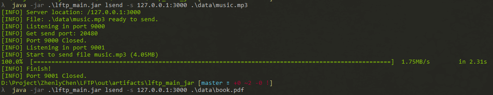

# LFTP

Send and receive large file by UDP



## Usage

```bash
Usage: lftp [-hV] [COMMAND]
Send and receive large file by udp.
  -h, --help      Show this help message and exit.
  -V, --version   Print version information and exit.
Commands:
  server  Send and receive large file by udp.
  lsend   Send file to server.
  lget    Get file from server.
  list    Get file list in server.

Usage: lftp server [-hV] [-c=<clientCount>] [-d=<dir>] [-p=<port>]
                   [-s=<portPoolStart>]
Send and receive large file by udp.
  -c, --client=<clientCount>
                      The number of clients at the same time.
  -d, --dir=<dir>     Server data folder.
  -h, --help          Show this help message and exit.
  -p, --port=<port>   Server listen port.
  -s, --start=<portPoolStart>
                      Start port pool
  -V, --version       Print version information and exit.

Usage: lftp lsend [-hV] [-c=<controlPort>] [-p=<sendPort>] [-s=<server>]
                  [<files>...]
Send file to server.
      [<files>...]        File path
  -c, --control=<controlPort>
                          Control port.
  -h, --help              Show this help message and exit.
  -p, --port=<sendPort>   Data port.
  -s, --server=<server>   Server location.
  -V, --version           Print version information and exit.

Usage: lftp lget [-hV] [-c=<controlPort>] [-d=<dir>] [-p=<dataPort>]
                 [-s=<server>] [<files>...]
Get file from server.
      [<files>...]        File path
  -c, --control=<controlPort>
                          Control Port
  -d, --dir=<dir>         Your file will download to this folder.
  -h, --help              Show this help message and exit.
  -p, --port=<dataPort>   Data Port.
  -s, --server=<server>   Server location.
  -V, --version           Print version information and exit.

Usage: lftp list [-hV] [-s=<server>]
Get file list in server.
  -h, --help              Show this help message and exit.
  -s, --server=<server>   Server location.
  -V, --version           Print version information and exit.
```

### Example

```bash
# Run a server in port 3000
$ java -jar lftp.jar server -p 3000 -d ./serverData
# Send a file(./data/test.txt)
$ java -jar lftp.jar lsend -s 127.0.0.1:3000 ./data/test.txt
# Get a file(test.txt) to ./data
$ java -jar lftp.jar lget -s 127.0.0.1:3000 -d ./data test.txt
# List file in server
$ java -jar lftp.jar list -s 127.0.0.1:3000
```

## Feature

- 快速，基于UDP传输，可跑满100Mbps带宽
- 可靠，保证每个数据包的按序并且确保到达，传输的文件依旧原汁原味
- 稳定，完备的流量控制和拥塞控制保证可以适应各种波动和恶劣的网络环境
- 并发，支持多用户同时上传和下载文件
- 简便，无需额外配置，开箱即用
- 强大，支持内网穿透，处于任意内网客户端都可以向公网服务端发送和获取文件

## Design

[Design-doc.md](./docs/Design-doc.md)

## Test

[Test-doc.md](./docs/Test-doc.md)

## Release

[LFTP V1.0.1](https://github.com/ZhenlyChen/LFTP/releases/tag/1.0.1)

- 添加超大文件测试

- 改进文件IO方法，提高写入速度，以更大粒度读取文件，增加IO缓存

- 改进进度条占用资源和显示

- 减少文件传输时资源消耗

- 修复不能支持2GB以上文件的BUG

- 增加发送缓冲区大小

- 修复一些小问题

[LFTP V1.0.0](https://github.com/ZhenlyChen/LFTP/releases/tag/1.0.0)

- 基本功能实现
