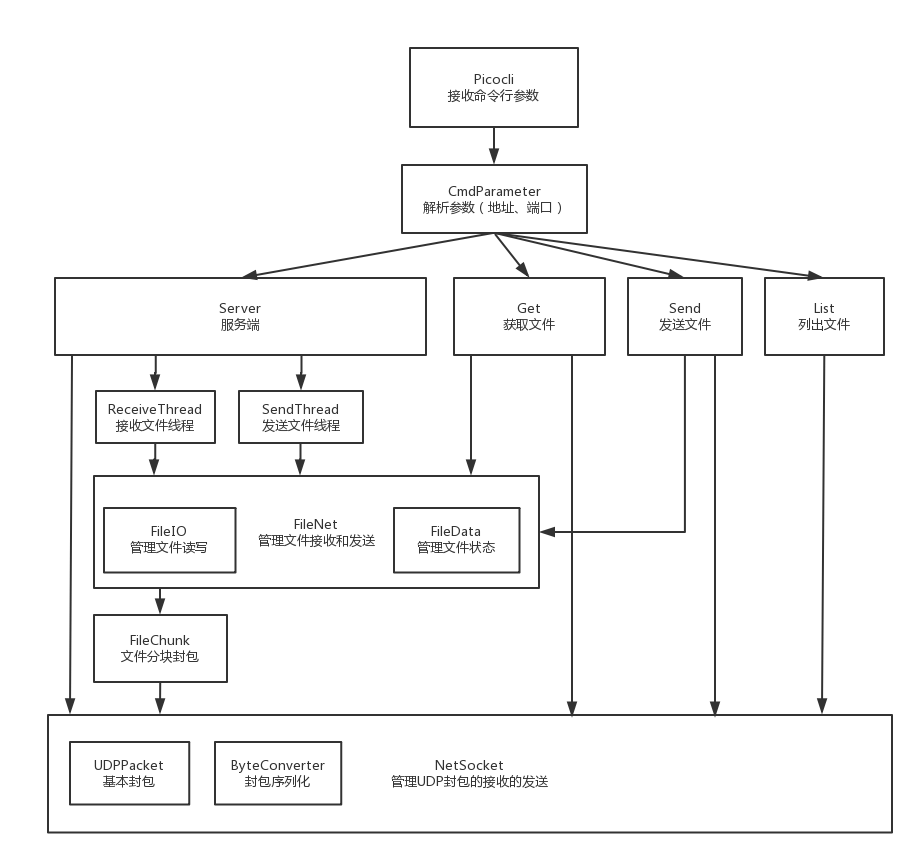
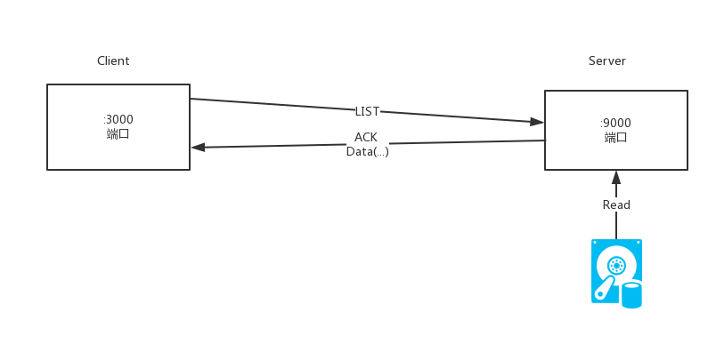

# LFTP Design Doc

设计文档

## 简介

LFTP是一个在任意两台计算机之间传输任意大小文件的工具


## 特点

- 基于UDP
- 100%可靠性
- 流量控制
- 拥堵控制
- 并发传输


## 架构

### 项目结构

项目树：

```bash
.
├── cmd # 命令行控制
│   ├── CmdParameter.java  # 解析命令行参数
│   ├── Get.java # 从服务器获取文件
│   ├── GetList.java # 从服务器获取文件列表
│   ├── Main.java # 程序主入口
│   ├── Send.java # 向服务器发送文件
│   ├── Server.java # 开启服务器
│   └── Util.java # 解析数据
├── net
│   ├── ByteConverter.java # 封包序列化转换
│   ├── FileChunk.java # 文件块封包
│   ├── FileData.java # 文件块管理
│   ├── NetSocket.java # 网络通讯管理
│   └── UDPPacket.java # 基本封包
└── service
    ├── FileIO.java # 文件IO管理
    ├── FileNet.java # 文件收发管理
    ├── Percentage.java # 进度条显示
    ├── ReceiveThread.java # 接收文件线程
    └── SendThread.java # 发送文件线程
```

架构图：



程序由`Picocli`接收命令行的各种参数，然后交给`CmdParameter`解析，根据参数执行不同的命令。

主要有两个核心模块：

#### NetSocket

这个模块管理UDP的封包、接收和发送。

发送的时候，将数据封包并放入发送缓冲当中。

发送使用**流水线协议**，并且使用**GBN协议**保证数据一定发送到对方并且是有序的，保证**可靠的数据传输**

使用**流量控制服务**，通过在`UDPPacket`封包的ACK回执中附带当前接收窗口的剩余空间，发送方控制自己的发送速率和窗口大小，达到流量控制的效果

使用**TCP的拥塞控制算法**，维护一个**发送窗口大小**和**阈值**，当收到错误的包或者重复三次同样的ACK包的时候，就减少窗口大小，防止拥塞发生。

#### FileNet

一些普通的请求，可以直接调用`NetSocket`进行收发，而对于文件块的收发，就需要通过`FileNet`进行统一管理。将文件数据放入`FileChunk`再次封包放入`UDPPacket`的`data`字段，又`FileNet`进行解析和封装。

同时，对于本地文件进行操作，分块读取或者写入文件


### 封包类型

本程序基于UDP报文段，在UDP基础上封装了两层结构。

UDP报文段


UDPPacket基本报文段（存放于UDP的应用数据部分）：


FileChunk 文件分块报文段（存放于UDPPacket的Data部分）：


### 基本流程

这里的流程参考FTP的被动模式，首先客户端向服务端指定的端口发送请求命令，然后服务端新开一个数据传输端口，并且把端口号发送给客户端，然后客户端向这个数据传输端口获取文件数据或者发送文件数据。

#### 发送文件到服务器


具体工作过程：

- 客户端向服务端请求发送文件，并且把这次会话的ID发送给服务端
- 服务端接收到发送文件请求，从空闲地址池中选择一个端口，在这个端口上监听接收的数据
- 客户端接收到服务端的数据端口，然后从自己的数据端口中发送文件各个分块的数据到服务器的数据端口，并且附带这次的会话ID
- 服务端接收到文件分块之后写入硬盘，并且向客户端发送确认回执
- 客户端接收到所有文件分块的回执之后，向服务端发送结束信号
- 服务端接收到结束信号（或者超时10s）之后关闭端口，放回空闲地址池
- 客户端收到结束信号之后同样关闭端口


#### 从服务器下载文件

下载的过程和发送的过程类似，只是在数据传输部分将上面的客户端和服务端交换过来。


具体工作过程：

- 客户端向服务端请求获取文件，并且把这次会话的ID发送给服务端
- 服务端接收到获取文件请求，从空闲地址池中选择一个端口，在这个端口上向客户端发送数据，并且附带这次的会话ID
- 客户端接收到文件分块之后写入硬盘，并且向服务端端发送确认回执
- 服务端接收到所有文件分块的回执之后，向客户端发送结束信号
- 客户端接收到结束信号之后关闭端口，也想服务端发送结束信号
- 服务端收到结束信号之后关闭端口，把数据端口放回地址池中，等待下次的使用


#### 获取文件列表

这个比较简单，只需要对服务器发出一个简单的请求就可以实现，没有必要专门建立连接管理状态。





### 发送数据

为了提高传输速度，本项目使用移动窗口模式发送数据。

简单来说，就是同时发送和窗口大小相同的数据包个数，然后根据实际情况（拥塞算法）增加或者减少窗口大小。


