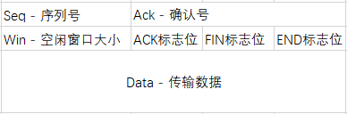
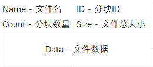

# LFTP Design Doc

设计文档

## 简介

LFTP是一个在任意两台计算机之间传输任意大小文件的工具


## 特点

- 基于UDP
- 100%可靠性
- 流量控制
- 拥堵控制
- 并发传输


## 架构

### 项目文件结构

```bash
.
├── cmd # 命令行控制
│   ├── CmdParameter.java  # 解析命令行参数
│   ├── Get.java # 从服务器获取文件
│   ├── GetList.java # 从服务器获取文件列表
│   ├── Main.java # 程序主入口
│   ├── Send.java # 向服务器发送文件
│   └── Server.java # 开启服务器
├── net
│   ├── ByteConverter.java # 封包序列化转换
│   ├── FileChunk.java # 文件块封包
│   ├── FileData.java # 文件块管理
│   ├── NetSocket.java # 网络通讯管理
│   ├── UDPPacket.java # 基本封包
│   └── Util.java # 通用工具包
└── service
    ├── FileIO.java # 文件IO管理
    ├── FileNet.java # 文件收发管理
    ├── Percentage.java # 进度条显示
    ├── ReceiveThread.java # 接收文件线程
    └── SendThread.java # 发送文件线程
```


### 封包类型

本程序基于UDP报文段，在UDP基础上封装了两层结构。

UDP报文段


UDPPacket基本报文段：



FileChunk 文件分块报文段：




### 基本流程

