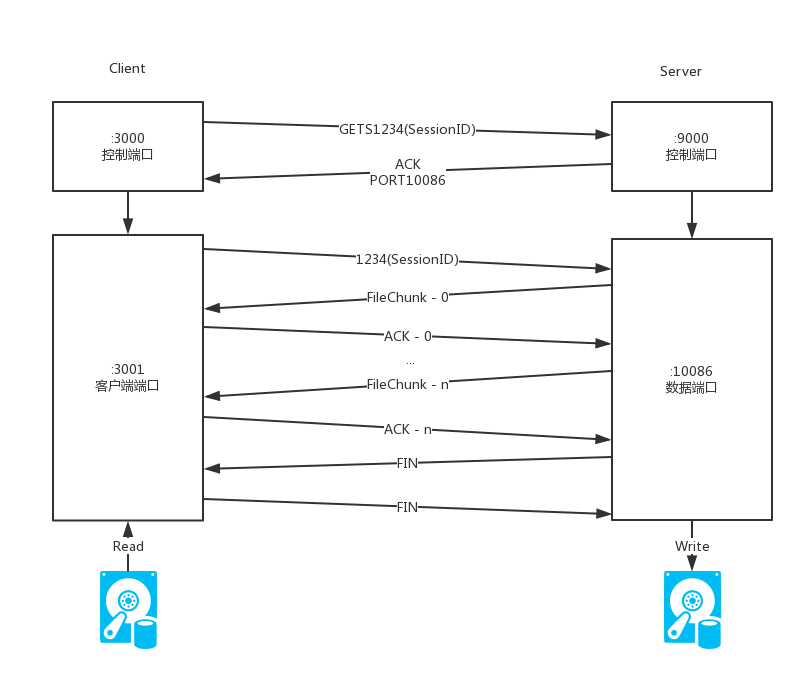

# LFTP Design Doc

设计文档

## 简介

LFTP是一个在任意两台计算机之间传输任意大小文件的工具


## 特点

- 基于UDP
- 100%可靠性
- 流量控制
- 拥堵控制
- 并发传输


## 架构

### 项目文件结构

```bash
.
├── cmd # 命令行控制
│   ├── CmdParameter.java  # 解析命令行参数
│   ├── Get.java # 从服务器获取文件
│   ├── GetList.java # 从服务器获取文件列表
│   ├── Main.java # 程序主入口
│   ├── Send.java # 向服务器发送文件
│   └── Server.java # 开启服务器
├── net
│   ├── ByteConverter.java # 封包序列化转换
│   ├── FileChunk.java # 文件块封包
│   ├── FileData.java # 文件块管理
│   ├── NetSocket.java # 网络通讯管理
│   ├── UDPPacket.java # 基本封包
│   └── Util.java # 通用工具包
└── service
    ├── FileIO.java # 文件IO管理
    ├── FileNet.java # 文件收发管理
    ├── Percentage.java # 进度条显示
    ├── ReceiveThread.java # 接收文件线程
    └── SendThread.java # 发送文件线程
```


### 封包类型

本程序基于UDP报文段，在UDP基础上封装了两层结构。

UDP报文段


UDPPacket基本报文段：


FileChunk 文件分块报文段：


### 基本流程

这里的流程参考FTP的被动模式，首先客户端向服务端指定的端口发送请求命令，然后服务端新开一个数据传输端口，并且把端口号发送给客户端，然后客户端向这个数据传输端口获取文件数据或者发送文件数据。

#### 发送文件到服务器


具体工作过程：

- 客户端向服务端请求发送文件，并且把这次会话的ID发送给服务端
- 服务端接收到发送文件请求，从空闲地址池中选择一个端口，在这个端口上监听接收的数据
- 客户端接收到服务端的数据端口，然后从自己的数据端口中发送文件各个分块的数据到服务器的数据端口，并且附带这次的会话ID
- 服务端接收到文件分块之后写入硬盘，并且向客户端发送确认回执
- 客户端接收到所有文件分块的回执之后，向服务端发送结束信号
- 服务端接收到结束信号（或者超时10s）之后关闭端口，放回空闲地址池
- 客户端收到结束信号之后同样关闭端口


#### 从服务器下载文件

下载的过程和发送的过程类似，只是在数据传输部分将上面的客户端和服务端交换过来。



具体工作过程：

- 客户端向服务端请求获取文件，并且把这次会话的ID发送给服务端
- 服务端接收到获取文件请求，从空闲地址池中选择一个端口，在这个端口上监听接收的数据
- 客户端接收到服务端的数据端口，然后从自己的数据端口中发送文件各个分块的数据到服务器的数据端口，并且附带这次的会话ID
- 服务端接收到文件分块之后写入硬盘，并且向客户端发送确认回执
- 客户端接收到所有文件分块的回执之后，向服务端发送结束信号
- 服务端接收到结束信号（或者超时10s）之后关闭端口，放回空闲地址池
- 客户端收到结束信号之后同样关闭端口