# LFTP - Test doc

测试文档

## 局域网测试

### 服务端

开启服务：

```bash
$ java -jar .\lftp_main.jar server
```

默认端口为`3000`，默认数据文件夹为`./serverData`，默认地址池为`20480-20489`

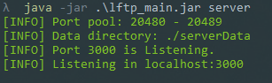

### 客户端

#### 发送数据

查看帮助信息

```bash
$ java -jar .\lftp_main.jar lsend -h
```

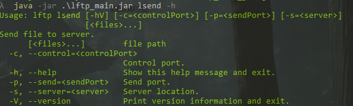


先发送一个4M大小的mp3文件

```bash
$ java -jar .\lftp_main.jar lsend -s 127.0.0.1:3000 ./data/music.mp3
```

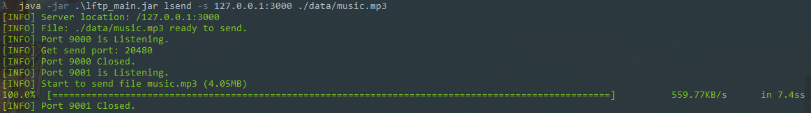

然后再发送一个120M的PDF文件

```bash
$ java -jar .\lftp_main.jar lsend -s 127.0.0.1:3000 ./data/book.pdf
```

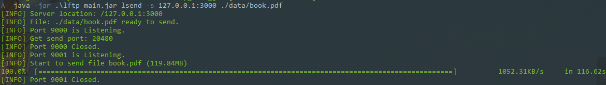

然后测试并行发送

开启两个客户端，由于是并行发送，因此需要分别设置不同的不同的控制和发送端口，可以看到，服务器分别为这两个客户端开启了`20480`和`20482`端口，同时接收两者发送的数据。

测试1（发送过程）：

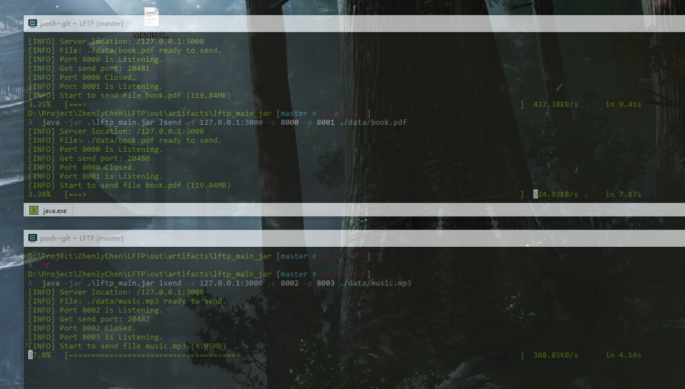

测试2（发送结束）：

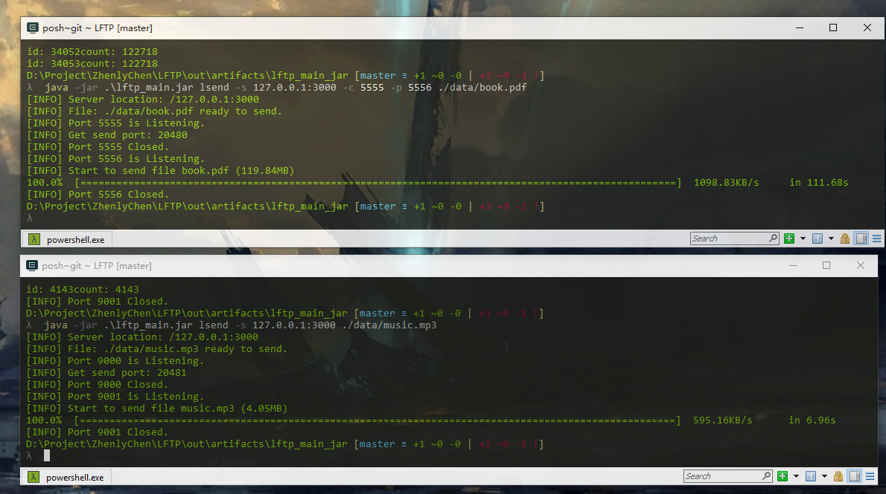

查看其占用的内存，并不是把整个文件直接读入内存的


服务端信息：

接收到了两个文件，都是在`20480`端口完成传输的。

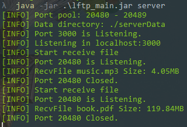


#### 查看文件列表

```bash
$ java -jar .\lftp_main.jar list -s 127.0.0.1:3000
```

可以看出文件被发送到服务端

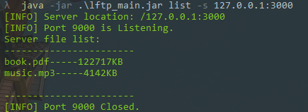

#### 接收文件

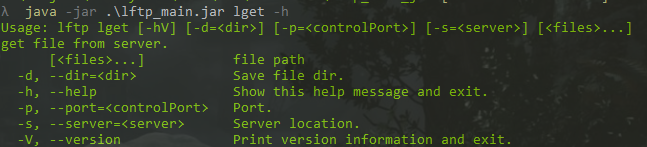

```bash
$ java -jar .\lftp_main.jar lget -s 127.0.0.1:3000 -d ./download music.mp3
```

从服务端获取刚才发送的MP3文件，并放入`./download`文件夹中

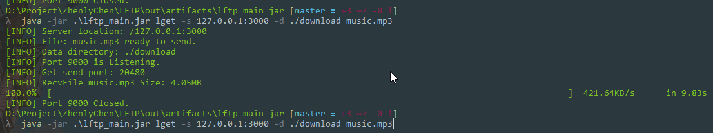

```bash
$ java -jar .\lftp_main.jar lget -s 127.0.0.1:3000 -d ./download book.pdf
```

然后下载刚才发送的比较大的120MB的pdf文件

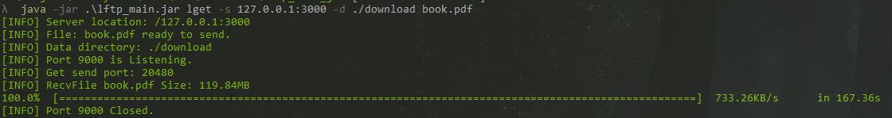

服务端显示发送了三个文件，同样是通过`20480`端口发送的

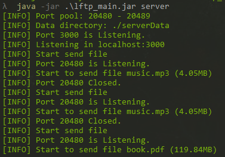

现在再来测试以下并行接收：

从两个端口从服务端分别下载文件

```bash
$ java -jar .\lftp_main.jar lget -s 127.0.0.1:3000 -p 5555 -d ./download book.pdf
$ java -jar .\lftp_main.jar lget -s 127.0.0.1:3000 -p 5556 -d ./download music.mp3
```

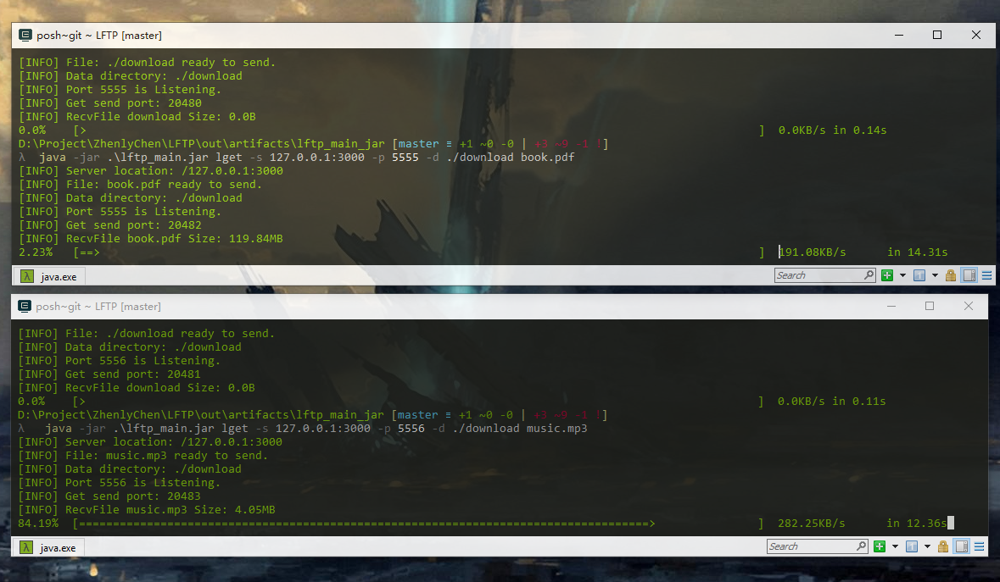

两个客户端同时接收来自服务器的数据，分别在不同的端口。

服务端也同时开启了两个端口发生数据给客户端：

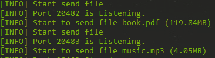

最后两个客户端都成功完整接收到文件

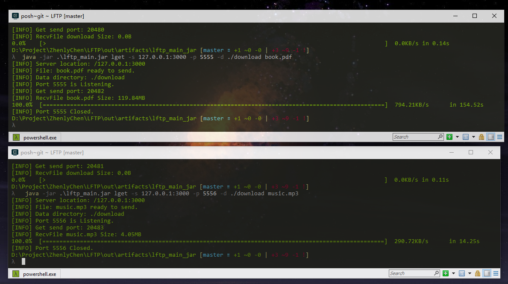


## 互联网测试

### 测试环境

服务器：`腾讯云`

配置：`2核2G`

带宽：上行`1Mbps`，下行`8Mbps`

系统：`CentOS 7.3 64位`

运行环境：`Java 11`

公网IP：`111.230.240.70 `(广州)

指向服务器IP的域名：`love.zhenly.cn`

由于比较穷，只能在1Mbps的小水管服务器上测试

### 服务端

指定在`3001`端口上开启服务

```bash
$ java -jar lftp_main.jar server -p 3001
```

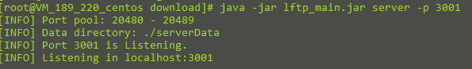


### 客户端

#### 发送文件

这里通过url向服务器发送一个mp3文件

```bash
$ java -jar lftp_main.jar lsend -s love.zhenly.cn:3001 ./data/music.mp3
```


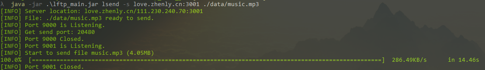

整个文件都被完整发送到服务器上

再发送一个120MB的pdf文件

```bash
$ java -jar .\lftp_main.jar lsend -s love.zhenly.cn:3001 ./data/book.pdf
```


服务端显示发送了若干个文件到客户端中

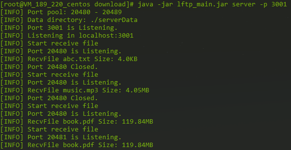

测试并行发送

需要指定不同控制和数据端口，否则端口绑定会发生冲突

```bash
$ java -jar .\lftp_main.jar lsend -s love.zhenly.cn:3001 -c 6666 -p 6667 ./data/book.pdf
$ java -jar .\lftp_main.jar lsend -s love.zhenly.cn:3001 ./data/music.mp3
```


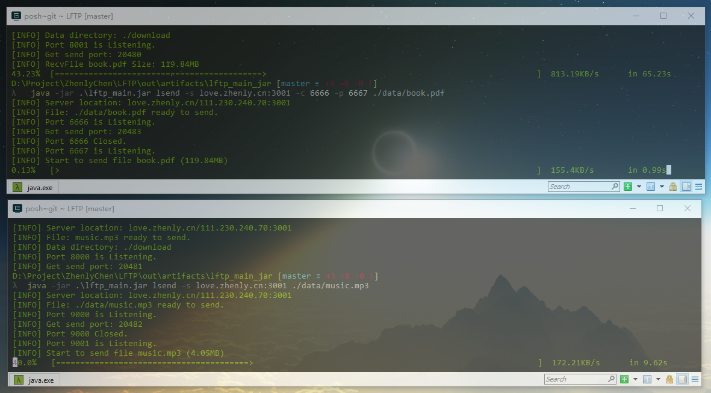

从服务端接收日志可以看出，两个文件分别再两个不同的端口进行接收

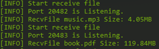

#### 查看文件列表

```bash
 java -jar .\lftp_main.jar list -s love.zhenly.cn:3001
```

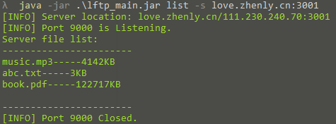

可以看到我们刚才发送到服务端的几个文件


#### 接收文件

由于这台服务器的上行带宽只有`1Mbps`，因此最大带宽也就是`128KB/s`，这里一般都能跑到`100KB/s`左右。

先下载一个4M的mp3文件

```bash
$ java -jar .\lftp_main.jar lget -s love.zhenly.cn:3001 -d ./download music.mp3
```

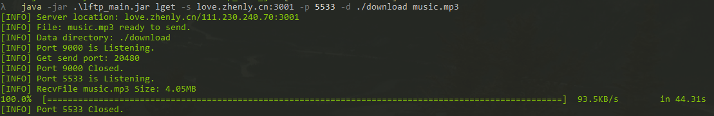


再下载一个120M的pdf文件

```bash
$ java -jar .\lftp_main.jar lget -s love.zhenly.cn:3001 -d ./download book.pdf
```

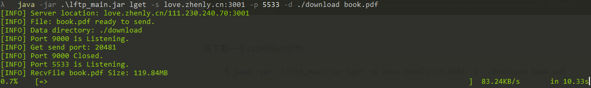

可以看出速度的确很慢

然后测试并行接收

需要指定两个不同的端口来接收文件，否则端口会产生冲突

```bash
$ java -jar .\lftp_main.jar lget -s love.zhenly.cn:3001 -p 3456 -d ./download music.mp3
$ java -jar .\lftp_main.jar lget -s love.zhenly.cn:3001 -p 5678 -d ./download book.pdf
```


可以看到，两个并行的客户端同时下载可以占满`1M`的小水管

