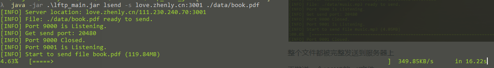
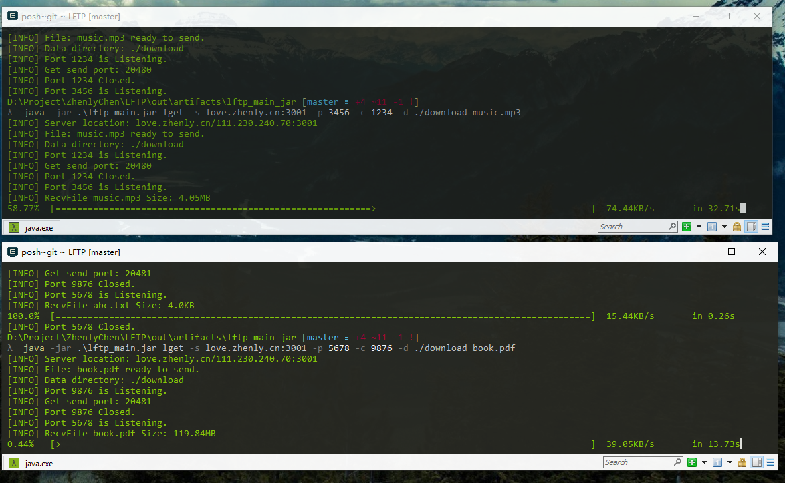
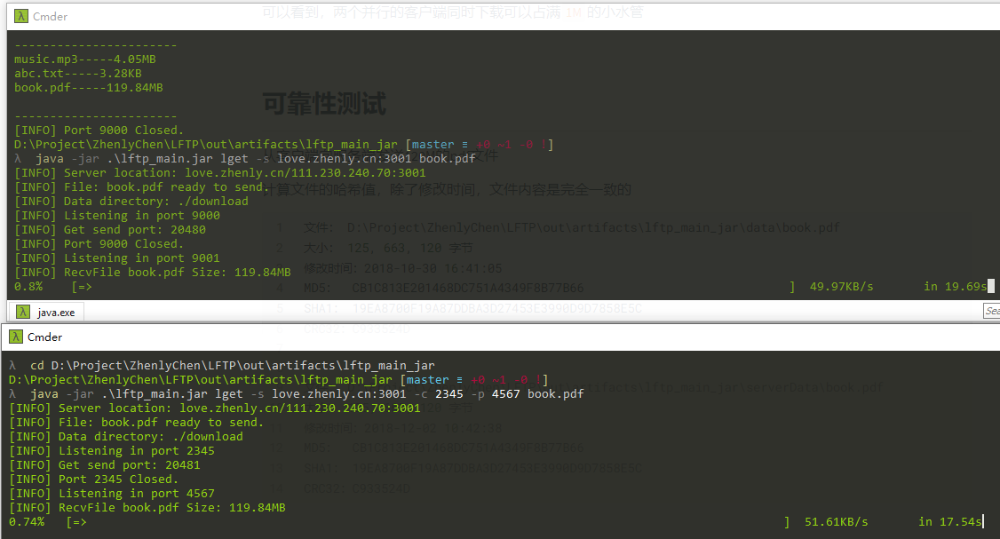
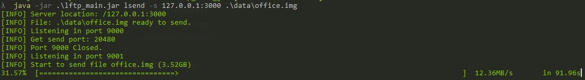
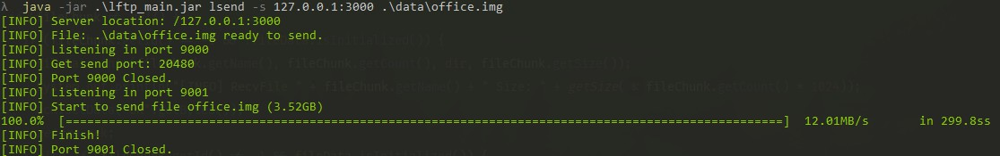
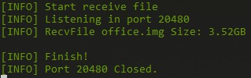

# LFTP - Test doc

测试文档

## 目录

* [LFTP \- Test doc](#lftp---test-doc)
  * [局域网测试](#%E5%B1%80%E5%9F%9F%E7%BD%91%E6%B5%8B%E8%AF%95)
    * [服务端](#%E6%9C%8D%E5%8A%A1%E7%AB%AF)
    * [客户端](#%E5%AE%A2%E6%88%B7%E7%AB%AF)
      * [发送数据](#%E5%8F%91%E9%80%81%E6%95%B0%E6%8D%AE)
      * [查看文件列表](#%E6%9F%A5%E7%9C%8B%E6%96%87%E4%BB%B6%E5%88%97%E8%A1%A8)
      * [接收文件](#%E6%8E%A5%E6%94%B6%E6%96%87%E4%BB%B6)
  * [互联网测试](#%E4%BA%92%E8%81%94%E7%BD%91%E6%B5%8B%E8%AF%95)
    * [测试环境](#%E6%B5%8B%E8%AF%95%E7%8E%AF%E5%A2%83)
    * [服务端](#%E6%9C%8D%E5%8A%A1%E7%AB%AF-1)
    * [客户端](#%E5%AE%A2%E6%88%B7%E7%AB%AF-1)
      * [发送文件](#%E5%8F%91%E9%80%81%E6%96%87%E4%BB%B6)
      * [查看文件列表](#%E6%9F%A5%E7%9C%8B%E6%96%87%E4%BB%B6%E5%88%97%E8%A1%A8-1)
      * [接收文件](#%E6%8E%A5%E6%94%B6%E6%96%87%E4%BB%B6-1)
  * [可靠性测试](#%E5%8F%AF%E9%9D%A0%E6%80%A7%E6%B5%8B%E8%AF%95)
  * [拥塞控制测试](#%E6%8B%A5%E5%A1%9E%E6%8E%A7%E5%88%B6%E6%B5%8B%E8%AF%95)
  * [流量控制测试](#%E6%B5%81%E9%87%8F%E6%8E%A7%E5%88%B6%E6%B5%8B%E8%AF%95)
  * [超大文件测试](#超大文件测试)

## 局域网测试

### 服务端

开启服务：

```bash
$ java -jar .\lftp_main.jar server
```

默认端口为`3000`，默认数据文件夹为`./serverData`，默认地址池为`20480-20489`


### 客户端

#### 发送数据

查看帮助信息

```bash
$ java -jar .\lftp_main.jar lsend -h
```


先发送一个4M大小的mp3文件

```bash
$ java -jar .\lftp_main.jar lsend -s 127.0.0.1:3000 ./data/music.mp3
```


然后再发送一个120M的PDF文件

```bash
$ java -jar .\lftp_main.jar lsend -s 127.0.0.1:3000 ./data/book.pdf
```


然后测试并行发送

开启两个客户端，由于是并行发送，因此需要分别设置不同的不同的控制和发送端口，可以看到，服务器分别为这两个客户端开启了`20480`和`20482`端口，同时接收两者发送的数据。

测试1（发送过程）：


测试2（发送结束）：


查看其占用的内存，并不是把整个文件直接读入内存的


服务端信息：

接收到了两个文件，都是在`20480`端口完成传输的。


#### 查看文件列表

```bash
$ java -jar .\lftp_main.jar list -s 127.0.0.1:3000
```

可以看出文件被发送到服务端


#### 接收文件


```bash
$ java -jar .\lftp_main.jar lget -s 127.0.0.1:3000 -d ./download music.mp3
```

从服务端获取刚才发送的MP3文件，并放入`./download`文件夹中


```bash
$ java -jar .\lftp_main.jar lget -s 127.0.0.1:3000 -d ./download book.pdf
```

然后下载刚才发送的比较大的120MB的pdf文件


服务端显示发送了三个文件，同样是通过`20480`端口发送的


现在再来测试以下并行接收：

从两个端口从服务端分别下载文件

```bash
$ java -jar .\lftp_main.jar lget -s 127.0.0.1:3000 -p 5555 -d ./download book.pdf
$ java -jar .\lftp_main.jar lget -s 127.0.0.1:3000 -p 5556 -d ./download music.mp3
```


两个客户端同时接收来自服务器的数据，分别在不同的端口。

服务端也同时开启了两个端口发生数据给客户端：


最后两个客户端都成功完整接收到文件


## 互联网测试

### 测试环境

服务器：`腾讯云`

配置：`2核2G`

带宽：上行`1Mbps`，下行`8Mbps`

系统：`CentOS 7.3 64位`

运行环境：`Java 11`

公网IP：`111.230.240.70 `(广州)

指向服务器IP的域名：`love.zhenly.cn`

由于比较穷，只能在1Mbps的小水管服务器上测试

### 服务端

指定在`3001`端口上开启服务

```bash
$ java -jar lftp_main.jar server -p 3001
```


### 客户端

#### 发送文件

这里通过url向服务器发送一个mp3文件

```bash
$ java -jar lftp_main.jar lsend -s love.zhenly.cn:3001 ./data/music.mp3
```


整个文件都被完整发送到服务器上

再发送一个120MB的pdf文件

```bash
$ java -jar .\lftp_main.jar lsend -s love.zhenly.cn:3001 ./data/book.pdf
```




服务端显示发送了若干个文件到客户端中


测试并行发送

需要指定不同控制和数据端口，否则端口绑定会发生冲突

```bash
$ java -jar .\lftp_main.jar lsend -s love.zhenly.cn:3001 -c 6666 -p 6667 ./data/book.pdf
$ java -jar .\lftp_main.jar lsend -s love.zhenly.cn:3001 ./data/music.mp3
```


从服务端接收日志可以看出，两个文件分别再两个不同的端口进行接收


#### 查看文件列表

```bash
 java -jar .\lftp_main.jar list -s love.zhenly.cn:3001
```


可以看到我们刚才发送到服务端的几个文件


#### 接收文件

由于这台服务器的上行带宽只有`1Mbps`，因此最大带宽也就是`128KB/s`，这里一般都能跑到`100KB/s`左右。

先下载一个4M的mp3文件

```bash
$ java -jar .\lftp_main.jar lget -s love.zhenly.cn:3001 -d ./download music.mp3
```


再下载一个120M的pdf文件

```bash
$ java -jar .\lftp_main.jar lget -s love.zhenly.cn:3001 -d ./download book.pdf
```


可以看出速度的确很慢

然后测试并行接收

需要指定两个不同的端口来接收文件，否则端口会产生冲突

```bash
$ java -jar .\lftp_main.jar lget -s love.zhenly.cn:3001 -p 3456 -d ./download music.mp3
$ java -jar .\lftp_main.jar lget -s love.zhenly.cn:3001 -p 5678 -d ./download book.pdf
```



可以看到，两个并行的客户端同时下载可以占满`1M`的小水管


## 可靠性测试

从客户端向服务端发送120M的pdf文件

计算文件的哈希值，除了修改时间，文件内容是完全一致的

```bash
文件：	D:\Project\ZhenlyChen\LFTP\out\artifacts\lftp_main_jar\data\book.pdf
大小：	125, 663, 120 字节
修改时间：2018-10-30 16:41:05
MD5：	CB1C813E201468DC751A4349F8B77B66
SHA1：	19EA8700F19A87DDBA3D27453E3990D9D7858E5C
CRC32：C933524D


文件：	D:\Project\ZhenlyChen\LFTP\out\artifacts\lftp_main_jar\serverData\book.pdf
大小：	125, 663, 120 字节
修改时间：2018-12-02 10:42:38
MD5：	CB1C813E201468DC751A4349F8B77B66
SHA1：	19EA8700F19A87DDBA3D27453E3990D9D7858E5C
CRC32：C933524D
```


## 拥塞控制测试

由于局域网内带宽过大，看不出拥塞测试的效果，因此这里使用互联网环境，在1Mbps的带宽下同时下载文件

首先让一个客户端先开启下载，可以达到`100KB/s`的速度


然后使得两个客户端同时进行下载，在拥塞状态下，两个客户端的速度最终趋向平分，都是`50KB/s`左右




## 流量控制测试

因为接收者处理数据以及写入文件的速度是远大于网络速度的，因此这一部分比较难测试出来。


## 超大文件测试

上面的测试都是一些小文件，这里尝试

这里尝试传输一个大于2GB的文件

选择一个`3.52GB`的镜像文件在局域网内传输，客户端向服务端发送，速度可达`12.36MB/s`



查看其内存占用，即使是`3.52GB`的文件，其占用的内存也不会太多，仅仅为100多MB


完全接收之后一共花了不到5分钟



服务端也显示传输完毕



检测哈希值，服务端和客户端的文件是完全一致的

```bash
文件：	D:\Project\ZhenlyChen\LFTP\out\artifacts\lftp_main_jar\serverData\office.img
大小：	3, 775, 004, 672 字节
修改时间：2018-12-02 20:57:24
MD5：	D3829ED21798020734C679A57F7D6039
SHA1：	2A5AA62DEA78C5073775684FCEBE56405AF52F24
CRC32：C06CB3FB


文件：	D:\Project\ZhenlyChen\LFTP\out\artifacts\lftp_main_jar\data\office.img
大小：	3, 775, 004, 672 字节
修改时间：2018-09-30 22:57:03
MD5：	D3829ED21798020734C679A57F7D6039
SHA1：	2A5AA62DEA78C5073775684FCEBE56405AF52F24
CRC32：C06CB3FB
```

大文件测试通过
